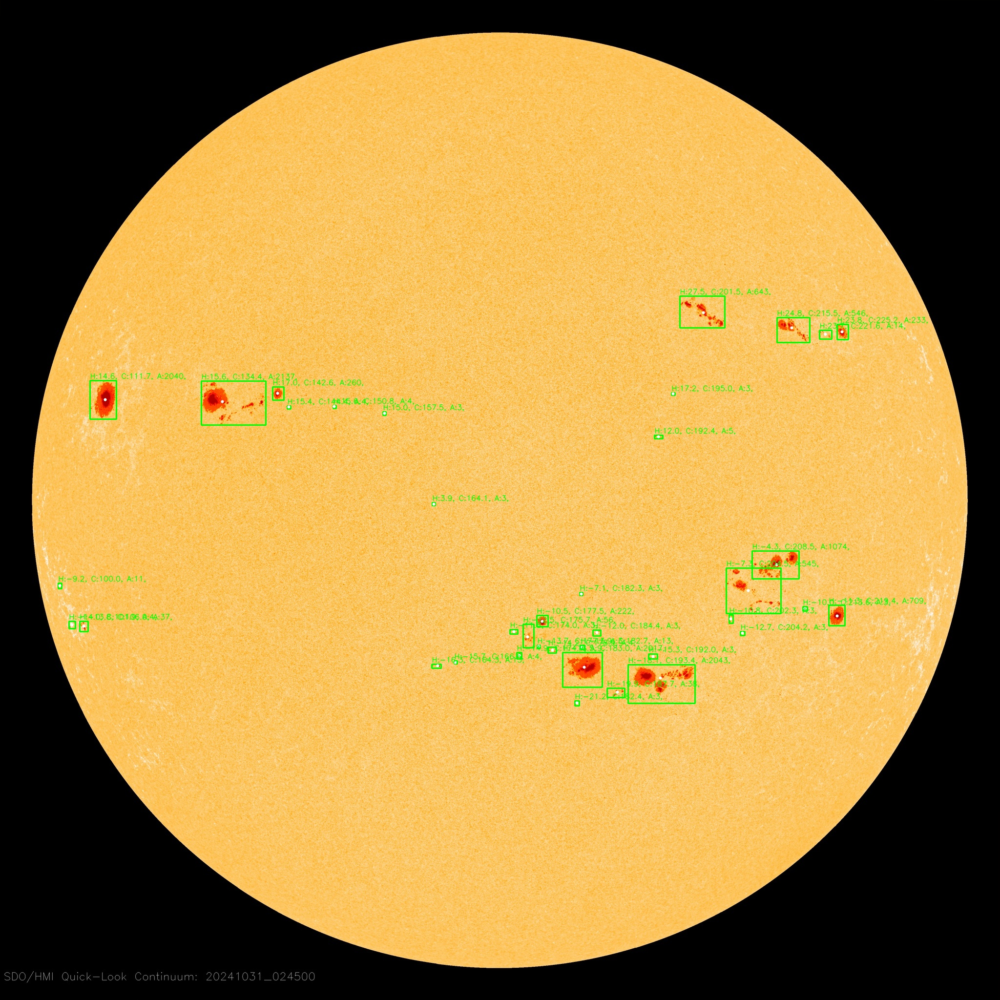
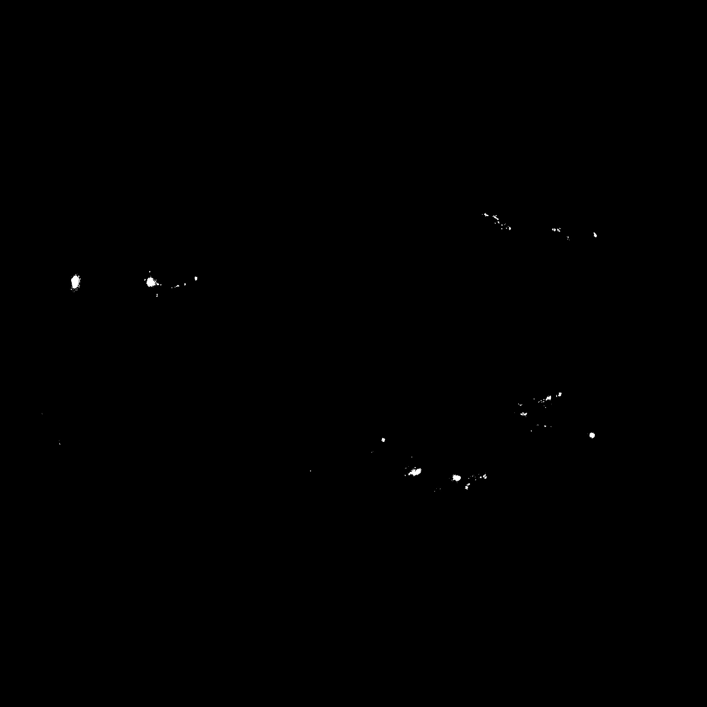
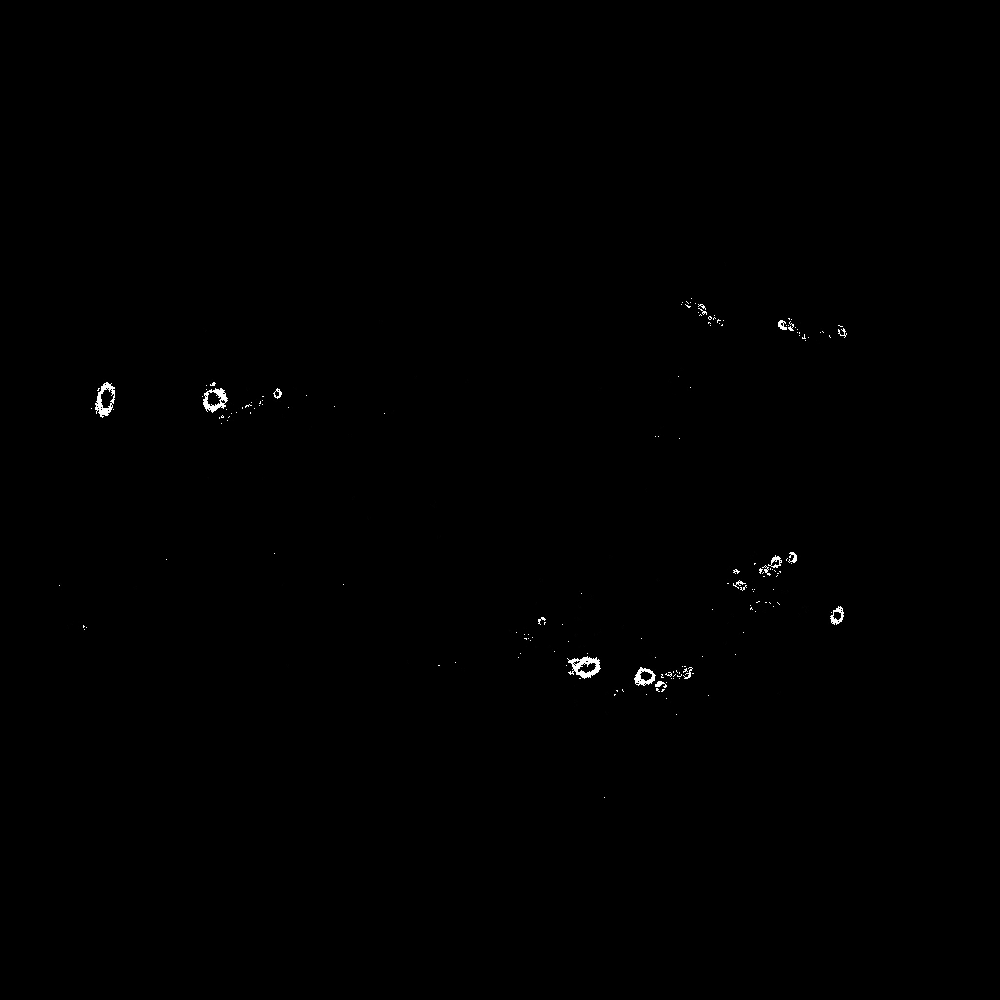
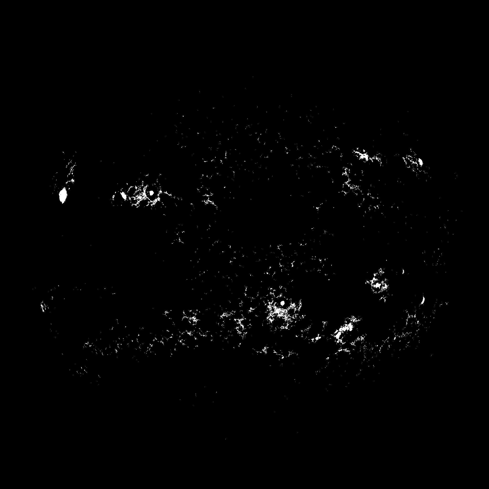
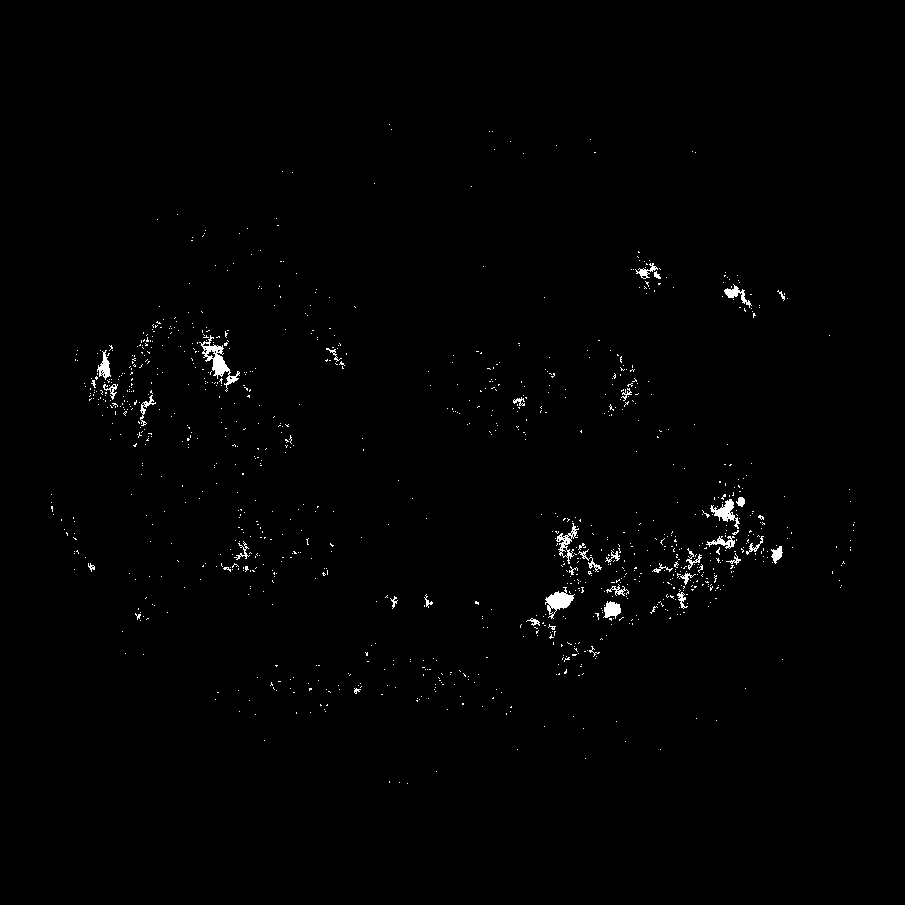
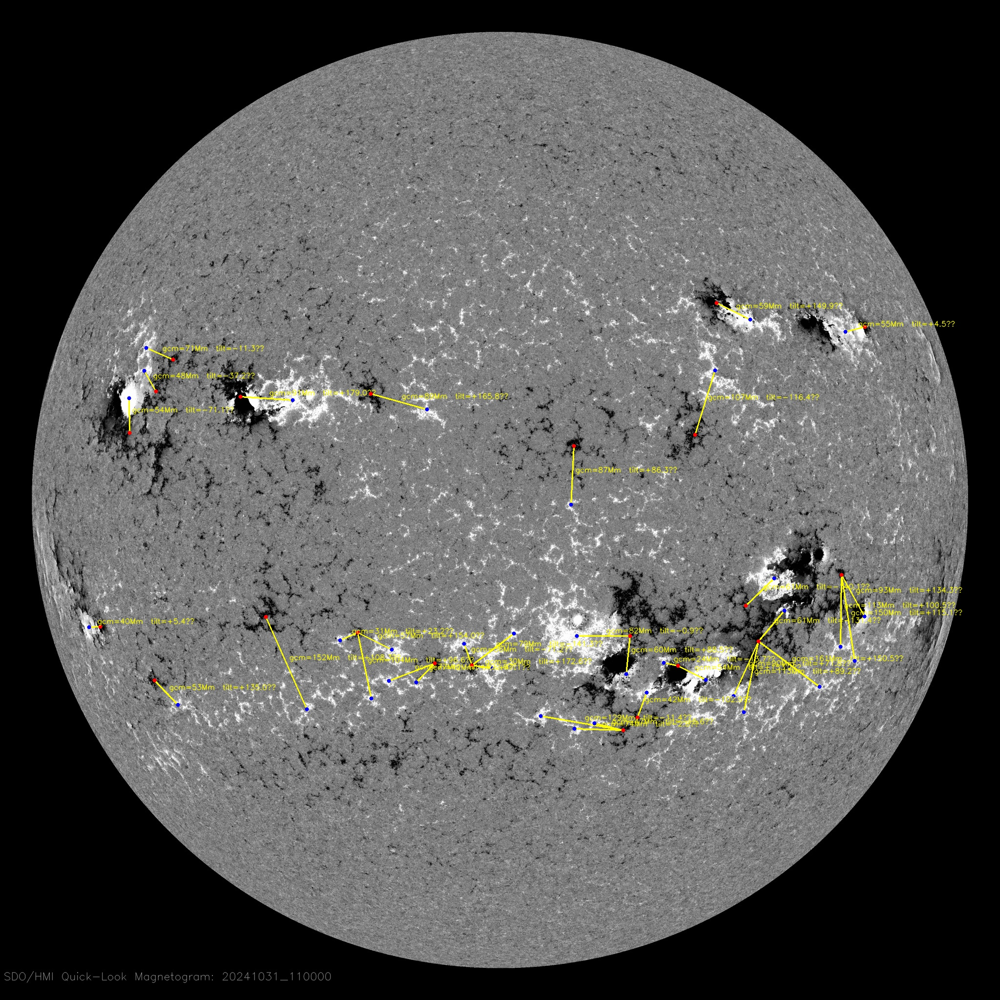

# Sunspot & Magnetic Bipole Analysis from SDO/HMI JPEGs

A physically informed computer-vision pipeline for automatic extraction of sunspot (umbra/penumbra) and magnetic features (positive/negative polarity) in SDO/HMI 2048×2048 JPG observations, with robust clustering, heliographic coordinates, and quantitative tilt/separation.

---

## Abstract

We present an end-to-end pipeline that operates directly on SDO/HMI 2048×2048 JPEG frames (not FITS). From a timestamped file name (`YYYYMMDD_HHMMSS_2048_*.jpg`), the code (i) segments the solar disk, (ii) partitions umbra and penumbra in continuum (HMIIF) images using robust statistics, (iii) separates positive/negative polarities in magnetograms (HMIB), (iv) clusters features with DBSCAN, and (v) converts results to physically meaningful descriptors: Stonyhurst latitude/longitude, Carrington longitude, foreshortening-corrected area in MSH, and tilts. Outputs are plain-text catalogs plus visual overlays for quality assurance.



*Figure 1. HMIIF continuum example with detected umbra/penumbra and group overlays.*

---

## Data

Inputs
- Continuum intensity: files matching `*HMIIF*.jpg`
- Line-of-sight magnetograms: files matching `*HMIB*.jpg`
- Filenames follow `YYYYMMDD_HHMMSS_2048_*.jpg`; the timestamp is parsed and used as observation time.

Outputs
- Continuum catalog: `results.txt`
- Magnetogram catalogs: `results_pos.txt`, `results_neg.txt`
- Bipole geometry: `results_bipole.txt`
- Overlays: mask and pairing previews saved under `.../mask_overlays/`

---

## Methods

### 1) Disk finding & coordinate system (common)
1. **Disk segmentation**: Otsu thresholding → largest external contour → ellipse fit; an eroded **safe disk mask** is used for in-disk operations.  
2. **Astrometric scale**: the angular solar radius at the observation time provides **arcsec/pixel** from the fitted disk radius.  
3. **Heliographic mapping**:  
   - Convert cluster centroids from **Helioprojective** (observer = SDO) to **Stonyhurst** and **Carrington** coordinates.  
   - Compute **μ = cos θ** from the angular distance to disk center.  
   - Convert pixel areas to **MSH** using μ-correction and the fitted disk area.

### 2) Continuum (HMIIF): umbra–penumbra segmentation
**Robust thresholds** inside the disk using the median and MAD:
- Umbra: `Tu = median − 11σ`, where `σ ≈ 1.4826 × MAD`
- Penumbra: `Tp = median − 6σ` (with `Tu < I < Tp`)
- **Clustering**: DBSCAN on the union of umbra + penumbra with `eps = 10`, `min_samples = 3`.



*Figure 2. Umbra (top) and penumbra (bottom) masks from the robust thresholds.*

**Per-cluster properties include:**
- Pixel areas (umbra, penumbra, total) → μ-corrected **MSH**
- Centroid and bounding box (for overlays)
- Photometry: mean/sum brightness in umbra/penumbra and in a local quiet-Sun region
- **Tilt angle** from the first principal component (PCA of the mask geometry), normalized to [−90°, +90°]


*Figure 3. Additional continuum example with complex spot groups.*

### 3) Magnetogram (HMIB): polarity separation & clustering
- **Polarity thresholds** (inside the safe disk):
  - Positive field: DN > 235
  - Negative field: DN < 20
- Clustering: DBSCAN on each polarity with `eps=15`, `min_samples=300`; tiny/noisy detections are discarded (e.g., clusters with <100 points).
- Per-cluster properties: pixel area → MSH, centroid, bounding box, mean/sum DN within mask, and local background statistics.



*Figure 4. HMIB polarity masks derived from fixed DN thresholds inside the solar disk (top: positive; bottom: negative).*

### 4) Bipole geometry
- **Nearest-neighbor pairing**: for each positive cluster, select the negative cluster with the minimum great-circle distance on the sphere.  
- **Outputs per pair**:
  - **Separation** as great-circle distance (reported in **Mm**)
  - **Tilt angle** relative to the equator (Joy’s-law convention)


*Figure 5. Positive–negative pairing overlaid on the magnetogram: yellow lines show great-circle links; labels include separation (Mm) and tilt (°).*

---

## Results (example lines produced by the code)

- Continuum (sunspot group) line
```text
20120104_141500_2048_HMIIF, G0, deg(lat/lon)=(+20.70, −2.01), deg(carr)=68.37, mu=0.912,
area_px={'umbra': 2, 'penumbra': 6, 'total': 8},
area_MSH={'umbra': 0.37, 'penumbra': 1.12, 'total': 1.49},
mean_bright={'umbra': 119.0, 'penumbra': 146.7, 'quiet': 190.2},
sum_bright={...}, tilt_deg=−11.84
```

- Magnetogram (bipole) line
```text
20120104_234500_2048_HMIB, P3-N7, tilt_deg=+15.2, gcm=42.7
```
*Exact numeric values vary by frame; the field names and units are fixed by the code.*

> **(Plots to be added)** After the first push, we will add histograms/distributions derived from `results*.txt` (e.g., area in MSH, μ, tilt angles, and bipole separations) at appropriate places in this README.

---

## Limitations (current version)

- Cross-modal linkage not yet implemented: sunspot clusters (continuum) and magnetic clusters (magnetogram) are produced independently and not merged into unified AR objects.
- Bipole pairing is geometric nearest-neighbor only: complex morphologies (e.g., δ-configurations) may be mis-paired.
- Fixed DN thresholds for magnetograms: simple and fast, but not adaptive to noise/limb effects.

These limitations reflect the present code behavior and guide upcoming improvements.

---

## Repository Guide

- `SDO_intensity_to_dict.py` — continuum pipeline: disk → robust umbra/penumbra → DBSCAN groups → PCA tilt → heliographic coords & μ-corrected **MSH** → overlays & `results.txt`.  
- `SDO_magneto_to_dict.py` — magnetogram pipeline: disk → fixed polarity masks → DBSCAN → heliographic coords & MSH → nearest-neighbor bipole pairing (tilt & separation) → overlays & `results_*`.
- `example_images/` — sample overlays/masks used as figures in this README.
- `requirements.txt` — dependencies.

---

## Background & Related Reading (context only)

- Verbeeck et al., *Solar Physics* (2013): comparative study of automated AR/sunspot detection approaches.
- Baranyi et al., *Solar Physics* (2016): Debrecen sunspot data tools and field definitions (areas in MSH, positions).
- Quan et al., *Electronics* (2021): deep-learning approaches for AR detection on HMI.
